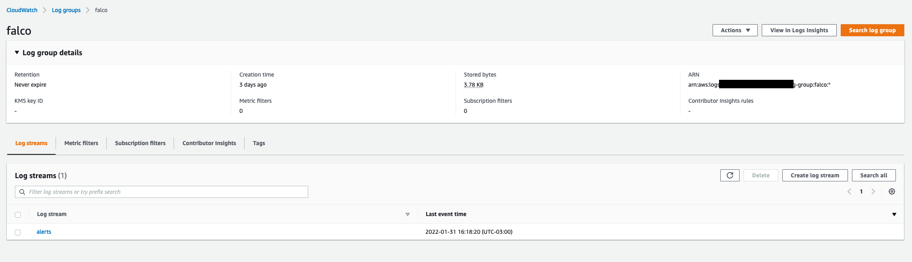
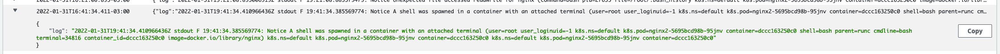
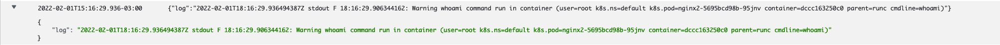

# Container Runtime Security with Falco

This demonstration is designed to explain how to use CNCF Falco for your Container Runtime security in Amazon EKS. We are going from deploying Falco inside you EKS cluster integrating with CloudWatch and create custom metrics.

**We are going to use a already provisioned EKS (Elastic Kubernetes Service) cluster, if you want to provision a new cluster please check [here](https://docs.aws.amazon.com/eks/latest/userguide/getting-started-eksctl.html).**

## Prerequisites

- eksctl
- kubectl
- Helm 3 >
- awscli

## Deploying Fluent Bit

Fluent Bit is an open source and multi-platform Log Processor and Forwarder which allows you to collect data/logs from different sources, unify and send them to multiple destinations. It’s fully compatible with Docker and Kubernetes environments. We will need Fluent Bit in order to export Falco logs to CloudWatch Logs.

To use IAM roles for service accounts in your cluster, we will first create an OIDC identity provider.

```bash
eksctl utils associate-iam-oidc-provider \
    --cluster <CLUSTER_NAME> \
    --approve
```

> With IAM roles for service accounts on Amazon EKS clusters, you can associate an IAM role with a Kubernetes service account. This service account can then provide AWS permissions to the containers in any pod that uses that service account. With this feature, you no longer need to provide extended permissions to the node IAM role so that pods on that node can call AWS APIs.

Creating an IAM role for the fluent-bit Service Account in the logging namespace.

```bash
kubectl create namespace logging

eksctl create iamserviceaccount \
    --name fluent-bit \
    --namespace logging \
    --cluster <CLUSTER_NAME> \
    --attach-policy-arn "arn:aws:iam::aws:policy/AdministratorAccess" \
    --approve \
    --override-existing-serviceaccounts
```

Make sure your service account with the ARN of the IAM role is annotated

```bash
kubectl -n logging describe sa fluent-bit
```

Deploy Fluent Bit

```bash
kubectl apply -f fluent-bit/
```

Wait for all of the pods to change to running status

```bash
kubectl --namespace=logging get pods
```

## Deploying CNCF Falco

[Falco](https://falco.org/) the cloud-native runtime security project, is the de facto Kubernetes threat detection engine.

Falco is the first runtime security project to join CNCF as an incubation-level project. Falco acts as a security camera detecting unexpected behavior, intrusions, and data theft in real time.

Add the Falco Helm repository locally.

```bash
helm repo add falcosecurity https://falcosecurity.github.io/charts && helm repo update
```

Install Falco using Helm with the default [values](https://github.com/falcosecurity/charts/blob/master/falco/values.yaml).

```bash
helm install falco falcosecurity/falco
```

Once this deployment is completed, Falco will be scanning our Kubernetes cluster pods for security or suspicious events behavior, exposing the logs to Stdout that will be collected by fluent-bit and exported to CloudWatch Logs.

Open the AWS Console and check Falco Log Group inside CloudWatch Logs.

<p align="center"> 

</p>

Open **alerts** Log stream, inside this log stream we are going to have the logs generated by Falco container.


## Provisioning an application for testing

We are going to use Nginx as our test application, so let's apply nginx deployment

```bash
kubectl apply -f deployment/
```

## Testing Default Rules

Before creating any personalized Rule, let's test a default one, so for that we are going to spawn a Shell inside one of our Nginx pods.

```bash
kubectl exec -it $(kubectl get po | grep -i nginx | awk '{print $1}' | head -n1) -- /bin/bash
```

Now let's look into alerts Logs Stream on CloudWatch Logs.

<p align="center"> 

</p>

Falco detected that a shell was spawned in our nginx container.

## Creating Custom Rules

Falco allows you to create custom rules using YAML, you can pass this custom values to Falco chart when installing or upgrading it.

If you want to know more about how to create custom rules click [here](https://falco.org/docs/rules/).

Let's create a custom rule that will notify us of anytime the command `whoami` runs inside a container.

```yaml
- rule: The program "locate" is run in a container
      desc: An event will trigger every time you run "locate" in a container
      condition: evt.type = execve and evt.dir=< and container.id != host and proc.name = locate
      output: "locate command run in container (user=%user.name %container.info parent=%proc.pname cmdline=%proc.cmdline)"
      priority: NOTICE
      warn_evttypes: False
```

We have to upgrade the chart with the custom value, so for that wxecute the following command.

```shell
helm upgrade falco -f custom-rules/custom-rules.yaml falcosecurity/falco

kubectl get po -ndefault -w
```

Once the Falco pods are running, let's log into a container and execute `whoami` command.

```shell
kubectl exec -it $(kubectl get po | grep -i nginx | awk '{print $1}' | head -n1) -- whoami
```

Go to CloudWatch Falco logs as we did above and check it.

<p align="center"> 

</p>

We are done, so with Falco custom rules we can create any rule that we want to protect our environment.

## Integrate Falco findings with Security Hub

We already have a published project that integrates Falco fidings with Security Hub using Lambda, check it [here](git@github.com:aws-samples/aws-securityhub-falco-ecs-eks-integration.git).

## Security

See [CONTRIBUTING](CONTRIBUTING.md#security-issue-notifications) for more information.

## License

This library is licensed under the MIT-0 License. See the LICENSE file.
